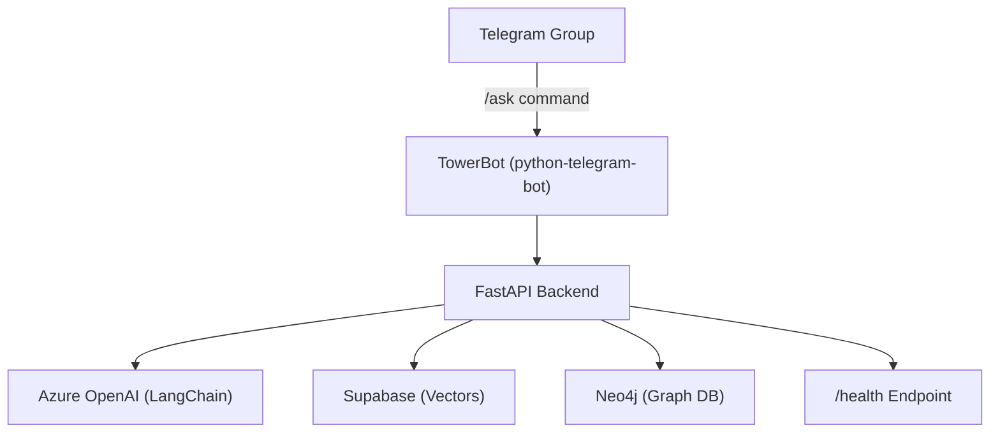

# TowerBot

[](https://github.com/frontiertower/towerbot)
[](LICENSE)

TowerBot is an open source, AI-powered Telegram assistant designed for Frontier Tower citizen developers. It answers questions, provides insights, and leverages persistent memory and external knowledge sources to empower your Telegram community.

**This project is licensed under the [MIT License](LICENSE) and is free for both commercial and non-commercial use.**

---

## ✨ What is TowerBot?

TowerBot connects your Telegram group to powerful AI and community data. It can answer questions, summarize information, and provide analytics—all with persistent memory and semantic search.

---

## 👥 Who is this for?

- Frontier Tower citizen developers
- Community managers who want smarter group chats
- Developers interested in AI, LLMs, and chatbots
- Contributors of all skill levels (beginner to advanced)
- Anyone looking to extend or self-host an AI Telegram bot

---

## 🛠️ Tech Stack

- **Python 3.12+**
- **FastAPI** (API backend)
- **python-telegram-bot** (Telegram integration)
- **Azure OpenAI** (LLM via LangChain)
- **Supabase** (vector search)
- **Neo4j** (graph database)
- **Docker** (optional, for deployment)

---

## 🧠 About Graphiti

TowerBot uses [**Graphiti**](https://github.com/getzep/graphiti) — a Python library for building temporal Knowledge Graphs using LLMs — to power its community graph analytics and persistent memory features.

**What is Graphiti?**

Graphiti is designed to manage evolving relationships and context over time by capturing and recording changes in facts and relationships. It enables TowerBot to construct a dynamic knowledge graph of your community, where facts (nodes and edges) can change as new data arrives. This allows TowerBot to:

- Track how relationships and facts change over time (temporal awareness)
- Maintain historical context for more accurate, context-aware answers
- Ingest both structured and unstructured data (e.g., Telegram messages, events, user interactions)
- Combine semantic and graph search for better recall and analytics

**How TowerBot uses Graphiti:**

- Stores and updates user, event, and project relationships in a Neo4j-powered graph
- Enables advanced community analytics and recommendations
- Supports persistent memory for conversations and group activity

For more on Graphiti, see: [Graphiti: A Python Library for Building Temporal Knowledge Graphs Using LLMs](https://help.getzep.com/graphiti)

---

## 🚀 Features

- **AI Q&A:** `/ask <question>` in Telegram, get instant answers
- **Persistent Memory:** Stores all questions/messages for analytics and context
- **Vector Search:** Semantic search over documents using Supabase
- **Graph Analytics:** Community graph features via Neo4j
- **Health Check:** `/health` endpoint for monitoring

---

## 🏗️ Architecture Overview


```mermaid
graph TD;
  TG["Telegram Group"] -->|/ask command| BOT["TowerBot (python-telegram-bot)"]
  BOT --> API["FastAPI Backend"]
  API --> AI["Azure OpenAI (LangChain)"]
  API --> DB["Supabase (Vectors)"]
  API --> GRAPH["Neo4j (Graph DB)"]
  API --> Health["/health Endpoint"]
```

---

## ⚡ Quickstart

### 1. Clone & Install

```bash
git clone <your-repo-url>
cd towerbot
pip install -r requirements.txt
```

### 2. Environment Setup

Create a `.env` file in the root directory with the following variables:

```env
APP_ENV=dev
AZURE_OPENAI_API_KEY=your-azure-openai-key
AZURE_OPENAI_ENDPOINT=your-azure-endpoint
BERLINHOUSE_EMAIL=your-email
BERLINHOUSE_PASSWORD=your-password
BOT_TOKEN=your-telegram-bot-token
DEFAULT_DATABASE=your-default-db
EMBEDDING_MODEL=your-embedding-model
GROUP_ID=your-telegram-group-id
LANGSMITH_API_KEY=your-langsmith-api-key
LANGSMITH_PROJECT=your-langsmith-project
LANGSMITH_TRACING=true
MODEL=your-azure-chat-model
NEO4J_PASSWORD=your-neo4j-password
NEO4J_URI=your-neo4j-uri
NEO4J_USER=your-neo4j-user
PORT=3000
REASONING_MODEL=your-azure-reasoning-model
SUPABASE_ANON_KEY=your-supabase-anon-key
SUPABASE_URL=your-supabase-url
WEBHOOK_URL=https://your-server-url
```

### 3. Run Locally

You can use the provided startup script to launch both the webhook and the FastAPI app:

```bash
./startup.sh
```

Or run manually:

```bash
uv run python -m app.webhook &
uv run uvicorn app.main:app --reload --port 3000 --host 0.0.0.0
```

The Telegram bot will start automatically as a background task.

### 4. Add to Telegram Group

- Add your bot to a Telegram group.
- Use `/ask <question>` to interact with the bot.

---

## 🧑‍💻 Local Development & Testing

- Use `uvicorn app.main:app --reload` for hot-reloading during development.
- Update dependencies in `pyproject.toml` as needed.
- Write tests for new features (test framework coming soon).
- Use Docker for consistent local environments:

```bash
docker build -t towerbot .
docker run -p 3000:3000 --env-file .env towerbot
```

---

## 📁 Project Structure

- `app/core/` — Config, prompts, tools, and lifespan (startup/shutdown logic)
- `app/services/` — AI, database, and graph services
- `app/models/` — Data models (e.g., QA response, ontology)
- `app/main.py` — FastAPI entrypoint
- `app/webhook.py` — Telegram webhook setup

---

## 🤝 Contributing

We welcome contributions from everyone! To get started:

1. **Fork the repo** and create your branch from `main`.
2. **Write clear, well-documented code** and add comments where helpful.
3. **Open a pull request** with a clear description of your changes.
4. For major changes, open an issue first to discuss what you’d like to change.
5. Be kind and respectful in all interactions.

**Ways to contribute:**

- New features
- Bug fixes
- Documentation improvements
- Tests and examples

---

## 💬 Getting Help

- Open an [issue](https://github.com/frontiertower/towerbot/issues) for bugs, questions, or feature requests.
- Join our Telegram group (link coming soon).
- See the resources below for tech-specific help.

---

## 🩺 Health Check

- `GET /health`: Returns API status and message.

---

## 📚 Resources

- [FastAPI Documentation](https://fastapi.tiangolo.com/)
- [python-telegram-bot](https://python-telegram-bot.org/)
- [Supabase Docs](https://supabase.com/docs)
- [LangChain](https://python.langchain.com/)
- [Azure OpenAI](https://learn.microsoft.com/en-us/azure/ai-services/openai/)
- [Neo4j](https://neo4j.com/docs/)

---

## 📝 License

TowerBot is open source and licensed under the [MIT License](LICENSE).

You are free to use, modify, and distribute this software for commercial and non-commercial purposes, subject to the terms of the MIT License.
